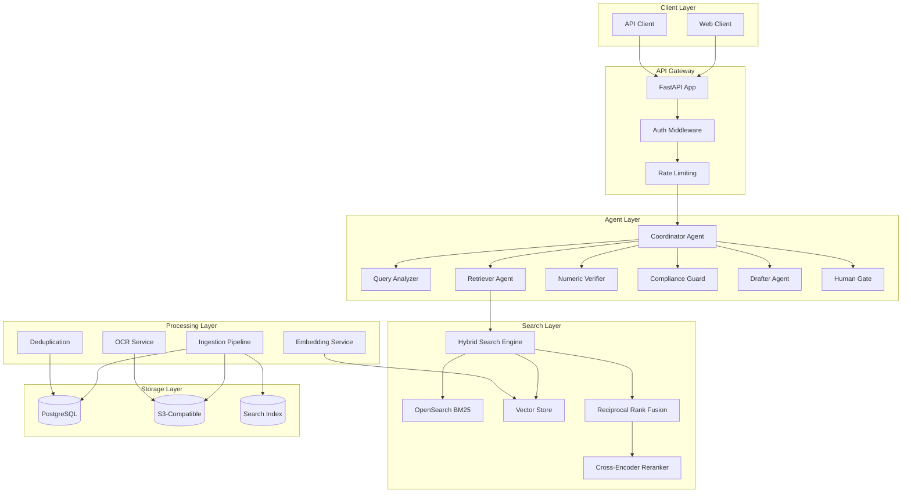
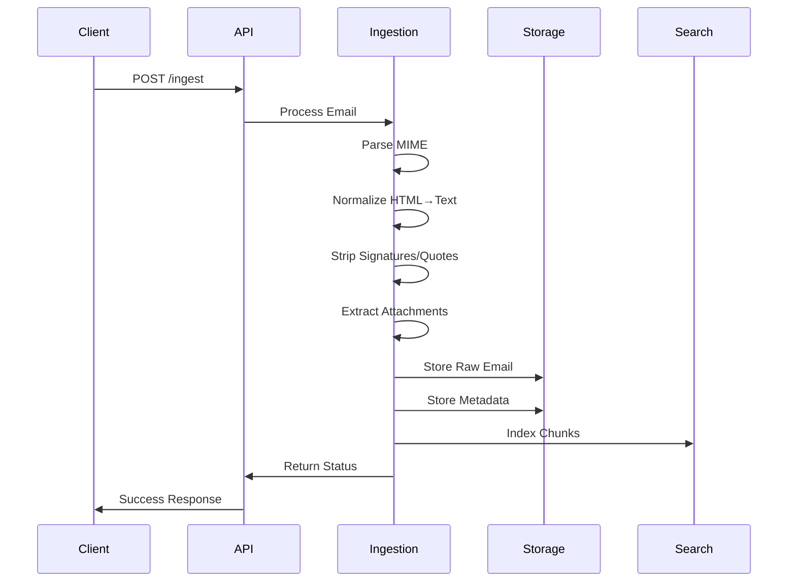
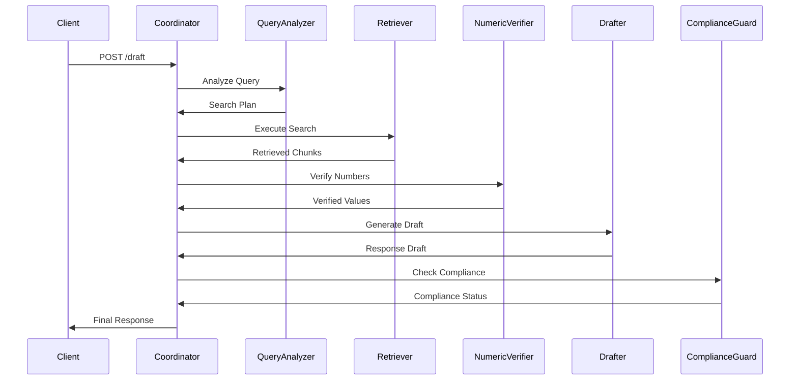
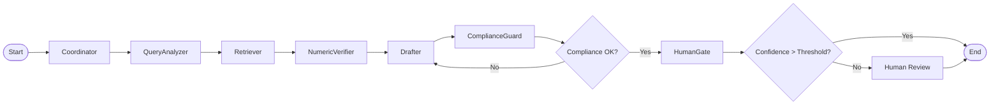
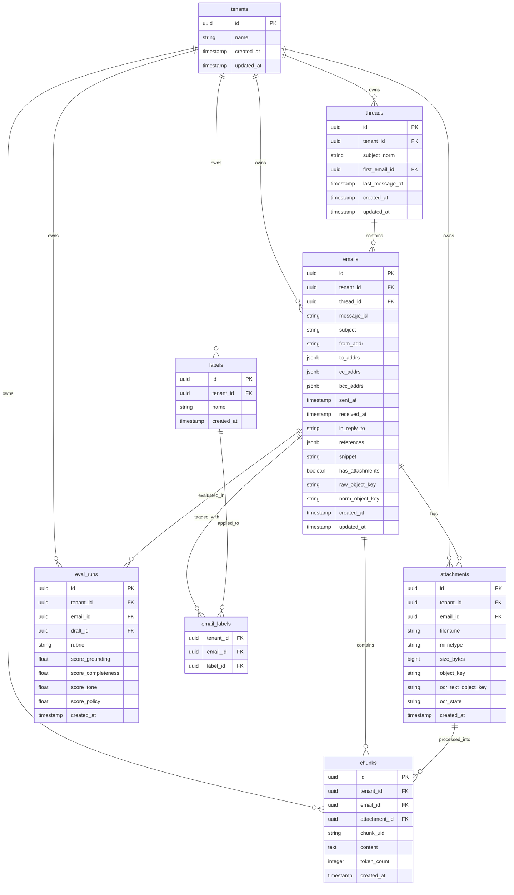

# Logistics Email AI - Design Specification

## Architecture Overview

The system follows a microservices architecture with LangGraph-based agent orchestration, hybrid search capabilities, and multi-tenant isolation.



## Data Flow

### Email Ingestion Flow


## Ingestion Pipeline

### Flow Overview
The ingestion pipeline follows a multi-stage processing flow designed for resilience, idempotency, and scalability:

```
Source → MIME Parse → Normalize → Attachments/OCR → Dedup → Storage Writes → DB Rows → Chunking → Embed Queue
```

### Phase 1 Sources
- **Local "Dropbox" Folder**: CSV/JSON manifest-driven ingestion for deterministic POC
- **File Manifest**: Structured input with email metadata and file paths
- **IMAP/Gmail Connectors**: Deferred to Phase 2 for production use

### Normalization Details
- **HTML→Text Conversion**: Clean, readable text extraction with formatting preservation
- **Signature Stripping**: Heuristic-based signature detection and removal
- **Quoted Text Handling**: Identification and marking of reply chains and quoted content
- **Language Detection**: Stub implementation with confidence scoring
- **Entity Hints**: Optional named entity recognition for logistics-specific terms

#### Normalizer I/O Contracts
- **Inputs**: Accepts raw content as bytes or str safely
- **Outputs**: Normalized UTF-8 text + normalization manifest
- **Manifest Fields**: input_type, charset_guess, stripped_blocks, lang, length_chars, token_estimate
- **Stability**: Normalized output is deterministic for hashing and chunking
- **Encoding**: UTF-8 with replace fallback for malformed content

### Attachment Processing
- **Text Extraction Priority**: DOCX/PDF text extraction first
- **OCR Task Creation**: Stub implementation for images and PDFs without text layers
- **Mimetype Allowlist**: Configurable allowed file types and size limits
- **Content Hashing**: SHA-256 for deduplication and integrity
- **Storage Write Points**: 
  - Raw email: `{tenant_id}/emails/{batch_id}/{email_id}/raw.eml`
  - Normalized text: `{tenant_id}/emails/{batch_id}/{email_id}/normalized.txt`
  - Attachments: `{tenant_id}/emails/{batch_id}/{email_id}/attachments/{filename}`
  - OCR text: `{tenant_id}/emails/{batch_id}/{email_id}/ocr/{attachment_id}.txt`
- **Database References**: All DB rows store object_keys pointing to storage objects
- **Storage Mapping Fields**:
  - Email.raw_object_key → raw email storage path
  - Email.norm_object_key → normalized text storage path
  - Attachment.object_key → attachment storage path
  - Attachment.ocr_text_object_key → OCR text storage path

### Deduplication Strategy
- **Exact Matching**: SHA-256 hash comparison for identical content
- **Near-Duplicate Detection**: Simhash/minhash algorithms with configurable thresholds
- **Lineage Recording**: Dedup relationships and batch-level metrics
- **Storage Optimization**: Skip redundant uploads while maintaining metadata
- **Dedup Thresholds**: 
  - Exact match (SHA-256 identical) → skip upload/DB row, increment dedup_exact counter
  - Near-dup (simhash/minhash ≥ 0.8 threshold) → link to canonical email_id, increment dedup_near counter
  - Dedup ratio = (dedup_exact + dedup_near) / total_emails
- **Lineage Tracking**: reference_count, first_seen_at, last_seen_at, canonical_email_id

### Chunking Approach
- **Semantic Splitting**: Configurable window size and overlap parameters
- **Stable UID Generation**: Deterministic chunk_uid creation rules
- **Token Budgeting**: Target token counts per chunk for embedding efficiency
- **Source Mapping**: Clear linkage to source emails and attachments

### Threading Implementation
- **Header-Based Linkage**: Message-Id, In-Reply-To, References parsing
- **Safe Fallbacks**: Subject normalization when headers are missing
- **Tenant Isolation**: All thread lookups scoped to tenant_id
- **Thread Metadata**: Thread-level aggregation and statistics

### Idempotency & Checkpoints
- **Batch Manifest**: Per-batch processing manifest with file counts
- **Job ID Tracking**: Unique job identifiers for resumability
- **Success Markers**: Last successful processing point per batch
- **Quarantine Bucket**: Bad input handling with audit trails
- **Checkpoint System**: 
  - Per-batch progress tracking with last_processed_email
  - Resume capability from last successful point
  - Batch completion markers for idempotent re-runs
- **Quarantine Categories**:
  - MALFORMED_MIME: Invalid email structure
  - OVERSIZED_EMAIL: Exceeds size limits
  - OVERSIZED_ATTACHMENT: Attachment too large
  - INVALID_MIMETYPE: Unsupported file types
  - PARSE_ERROR: Content parsing failures
  - STORAGE_ERROR: Storage write failures
  - DATABASE_ERROR: Database operation failures

### Observability Framework
- **Metrics Collection**: docs/sec, dedup_ratio, ocr_rate, failure_buckets, lag
- **Structured Logging**: JSON-formatted logs with trace_id propagation
- **Error Taxonomy**: Categorized failure modes with retry strategies
- **Performance Monitoring**: Processing time and throughput tracking

#### Batch Summary Schema
- **docs_total**: Total emails in batch
- **processed**: Successfully processed emails
- **failed**: Failed email count
- **dedup_exact**: Exact duplicate count (SHA-256)
- **dedup_near**: Near-duplicate count (simhash/minhash)
- **dedup_ratio**: (dedup_exact + dedup_near) / docs_total
- **ocr_tasks**: OCR tasks created
- **chunks_created**: Semantic chunks generated
- **elapsed_ms**: Total processing time


### Response Generation Flow


## LangGraph Agent Design

### Node Definitions

#### 1. Coordinator Agent
- **Purpose**: Orchestrates the entire workflow, manages budgets, and makes routing decisions
- **Input**: User query, tenant_id, context
- **Output**: Execution plan, agent routing decisions
- **Tools**: Budget calculator, plan validator

#### 2. Query Analyzer
- **Purpose**: Classifies intent, extracts entities, builds structured search plan
- **Input**: Natural language query
- **Output**: Intent classification, entities, search filters, semantic query
- **Tools**: NER, intent classifier, query builder

#### 3. Retriever Agent
- **Purpose**: Executes hybrid search and returns relevant chunks with citations
- **Input**: Search plan (filters + semantic query)
- **Output**: Ranked chunks with metadata, search scores
- **Tools**: BM25 search, vector search, RRF fusion, reranker

#### 4. Numeric Verifier
- **Purpose**: Computes distances, prices, dates using deterministic tools
- **Input**: Numeric computation requests
- **Output**: Verified numeric values with sources
- **Tools**: Distance calculator, rate card lookup, date calculator

#### 5. Compliance Guard
- **Purpose**: Checks policy compliance and tone requirements
- **Input**: Response draft
- **Output**: Compliance status, redaction recommendations
- **Tools**: Policy checker, tone analyzer, content filter

#### 6. Drafter Agent
- **Purpose**: Composes the final response with citations
- **Input**: Retrieved chunks, verified values, compliance status
- **Output**: Formatted response with citations
- **Tools**: Response template, citation formatter

#### 7. Human Gate (Optional)
- **Purpose**: Routes low-confidence responses for human review
- **Input**: Response draft, confidence scores
- **Output**: Approval decision or review request
- **Tools**: Confidence calculator, review queue

### Agent Graph Structure


## API Design

### Core Endpoints

#### POST /draft
Generate a response draft for a logistics query.

**Request:**
```json
{
  "query": "string",
  "tenant_id": "string",
  "context": {
    "email_thread_id": "string",
    "participant_info": "object",
    "business_rules": "object"
  },
  "options": {
    "include_citations": "boolean",
    "max_tokens": "integer",
    "temperature": "float"
  }
}
```

**Response:**
```json
{
  "draft": "string",
  "citations": ["array"],
  "confidence_score": "float",
  "compliance_status": "string",
  "processing_time": "float",
  "trace_id": "string"
}
```

#### POST /eval/run
Run evaluation on a response draft.

**Request:**
```json
{
  "response": "string",
  "ground_truth": "string",
  "tenant_id": "string"
}
```

**Response:**
```json
{
  "scores": {
    "grounding": "float",
    "completeness": "float",
    "tone": "float",
    "policy": "float"
  },
  "overall_score": "float",
  "passes_threshold": "boolean",
  "recommendations": ["array"]
}
```

#### GET /health
System health check endpoint.

**Response:**
```json
{
  "status": "healthy",
  "timestamp": "string",
  "version": "string",
  "components": {
    "database": "string",
    "search": "string",
    "agents": "string"
  }
}
```

### Data Transfer Objects (DTOs)

#### EmailChunk
```python
class EmailChunk(BaseModel):
    chunk_id: str
    email_id: str
    tenant_id: str
    content: str
    chunk_index: int
    metadata: Dict[str, Any]
    embedding: Optional[List[float]]
    created_at: datetime
    updated_at: datetime
```

#### SearchResult
```python
class SearchResult(BaseModel):
    chunk: EmailChunk
    bm25_score: float
    vector_score: float
    fusion_score: float
    rerank_score: Optional[float]
    final_rank: int
```

#### ResponseDraft
```python
class ResponseDraft(BaseModel):
    content: str
    citations: List[Citation]
    confidence_score: float
    compliance_status: ComplianceStatus
    processing_metadata: ProcessingMetadata
```

## Storage Schema

### PostgreSQL Tables

#### emails
- `id` (UUID, PK)
- `tenant_id` (UUID, FK)
- `thread_id` (UUID)
- `subject` (TEXT)
- `sender` (TEXT)
- `recipients` (JSONB)
- `sent_date` (TIMESTAMP)
- `received_date` (TIMESTAMP)
- `raw_content` (TEXT)
- `normalized_content` (TEXT)
- `metadata` (JSONB)
- `created_at` (TIMESTAMP)
- `updated_at` (TIMESTAMP)

#### email_chunks
- `id` (UUID, PK)
- `email_id` (UUID, FK)
- `tenant_id` (UUID, FK)
- `chunk_index` (INTEGER)
- `content` (TEXT)
- `metadata` (JSONB)
- `embedding` (VECTOR)
- `created_at` (TIMESTAMP)

#### attachments
- `id` (UUID, PK)
- `email_id` (UUID, FK)
- `tenant_id` (UUID, FK)
- `filename` (TEXT)
- `mime_type` (TEXT)
- `size` (BIGINT)
- `storage_path` (TEXT)
- `ocr_text` (TEXT)
- `created_at` (TIMESTAMP)

### Vector Store Schema
- **Collection**: `email_chunks_{tenant_id}`
- **Dimensions**: 1536 (OpenAI text-embedding-ada-002)
- **Distance Metric**: Cosine similarity
- **Metadata**: chunk_id, email_id, tenant_id, chunk_index, content_hash

### Search Index Schema
- **Index**: `emails_{tenant_id}`
- **Fields**: 
  - `content` (text, analyzed)
  - `subject` (text, analyzed)
  - `sender` (keyword)
  - `recipients` (keyword)
  - `sent_date` (date)
  - `metadata.*` (dynamic mapping)

## Ranking Flow

### Stage 1: Pre-filtering
- Apply tenant_id filter
- Apply date range filters
- Apply sender/recipient filters
- Apply content type filters

### Stage 2: Hybrid Search
- **BM25 Search**: Keyword-based relevance scoring
- **Vector Search**: Semantic similarity scoring
- **Fusion**: Reciprocal Rank Fusion (RRF) algorithm
- **Reranking**: Optional cross-encoder for top-k results

### RRF Algorithm
```python
def reciprocal_rank_fusion(bm25_results: List[SearchResult], 
                          vector_results: List[SearchResult], 
                          k: int = 60) -> List[SearchResult]:
    """
    Reciprocal Rank Fusion for combining BM25 and vector search results.
    
    RRF(d) = 1/(k + r(d)) where r(d) is the rank of document d
    """
    scores = {}
    
    for rank, result in enumerate(bm25_results):
        scores[result.chunk_id] = scores.get(result.chunk_id, 0) + 1/(k + rank + 1)
    
    for rank, result in enumerate(vector_results):
        scores[result.chunk_id] = scores.get(result.chunk_id, 0) + 1/(k + rank + 1)
    
    # Sort by RRF score and return top results
    return sorted(scores.items(), key=lambda x: x[1], reverse=True)
```

## Token & Cost Budgets

### Budget Allocation
- **Query Analysis**: 1000 tokens
- **Search Retrieval**: 2000 tokens
- **Numeric Verification**: 500 tokens
- **Draft Generation**: 3000 tokens
- **Compliance Check**: 1000 tokens
- **Total Budget**: 7500 tokens per request

### Cost Estimation
- **Input Tokens**: ~5000 tokens/request
- **Output Tokens**: ~2500 tokens/request
- **Estimated Cost**: $0.15-0.25 per request (GPT-4 pricing)

## Failure Modes & Mitigation

### Ingestion Failures
- **OCR Failures**: Retry with different OCR engines, fallback to manual review
- **Embedding Failures**: Exponential backoff, circuit breaker pattern
- **Storage Failures**: Dead letter queue, manual reprocessing

### Search Failures
- **Vector Store Down**: Fallback to BM25-only search
- **OpenSearch Down**: Fallback to vector-only search
- **Both Down**: Return cached results or error gracefully

### Agent Failures
- **Agent Timeout**: Circuit breaker, fallback to simpler workflow
- **LLM Errors**: Retry with exponential backoff, human fallback
- **Tool Failures**: Graceful degradation, alternative tool selection

### Performance Degradation
- **High Latency**: Request queuing, priority-based processing
- **Memory Pressure**: LRU cache eviction, request throttling
- **Concurrency Limits**: Queue management, graceful backoff

## Database Schema Design

### Entity Relationship Diagram



### Table Definitions

#### tenants
- `id` (UUID, PK) - Unique tenant identifier
- `name` (TEXT, NOT NULL) - Human-readable tenant name
- `created_at` (TIMESTAMP, NOT NULL, DEFAULT NOW())
- `updated_at` (TIMESTAMP, NOT NULL, DEFAULT NOW())

#### threads
- `id` (UUID, PK) - Unique thread identifier
- `tenant_id` (UUID, FK, NOT NULL) - References tenants.id
- `subject_norm` (TEXT) - Normalized subject line
- `first_email_id` (UUID, FK) - References emails.id
- `last_message_at` (TIMESTAMP) - Last message timestamp
- `created_at` (TIMESTAMP, NOT NULL, DEFAULT NOW())
- `updated_at` (TIMESTAMP, NOT NULL, DEFAULT NOW())

#### emails
- `id` (UUID, PK) - Unique email identifier
- `tenant_id` (UUID, FK, NOT NULL) - References tenants.id
- `thread_id` (UUID, FK, NOT NULL) - References threads.id
- `message_id` (TEXT, NOT NULL) - Email message ID
- `subject` (TEXT) - Email subject
- `from_addr` (TEXT) - Sender address
- `to_addrs` (JSONB) - Recipient addresses
- `cc_addrs` (JSONB) - CC addresses
- `bcc_addrs` (JSONB) - BCC addresses
- `sent_at` (TIMESTAMP) - When email was sent
- `received_at` (TIMESTAMP) - When email was received
- `in_reply_to` (TEXT) - In-reply-to header
- `references` (JSONB) - Reference headers
- `snippet` (TEXT) - Text snippet for preview
- `has_attachments` (BOOLEAN, DEFAULT FALSE) - Has attachments flag
- `raw_object_key` (TEXT) - Object storage key for raw email
- `norm_object_key` (TEXT) - Object storage key for normalized email
- `created_at` (TIMESTAMP, NOT NULL, DEFAULT NOW())
- `updated_at` (TIMESTAMP, NOT NULL, DEFAULT NOW())

#### attachments
- `id` (UUID, PK) - Unique attachment identifier
- `tenant_id` (UUID, FK, NOT NULL) - References tenants.id
- `email_id` (UUID, FK, NOT NULL) - References emails.id
- `filename` (TEXT) - Original filename
- `mimetype` (TEXT) - MIME type
- `size_bytes` (BIGINT) - File size in bytes
- `object_key` (TEXT) - Object storage key for attachment
- `ocr_text_object_key` (TEXT) - Object storage key for OCR text
- `ocr_state` (TEXT) - OCR processing state
- `created_at` (TIMESTAMP, NOT NULL, DEFAULT NOW())

#### chunks
- `id` (UUID, PK) - Unique chunk identifier
- `tenant_id` (UUID, FK, NOT NULL) - References tenants.id
- `email_id` (UUID, FK, NOT NULL) - References emails.id
- `attachment_id` (UUID, FK) - References attachments.id (optional)
- `chunk_uid` (TEXT, NOT NULL) - Stable chunk identifier
- `content` (TEXT, NOT NULL) - Chunk text content
- `token_count` (INTEGER) - Estimated token count
- `created_at` (TIMESTAMP, NOT NULL, DEFAULT NOW())

#### labels
- `id` (UUID, PK) - Unique label identifier
- `tenant_id` (UUID, FK, NOT NULL) - References tenants.id
- `name` (TEXT, NOT NULL) - Label name
- `created_at` (TIMESTAMP, NOT NULL, DEFAULT NOW())

#### email_labels
- `tenant_id` (UUID, FK, NOT NULL) - References tenants.id
- `email_id` (UUID, FK, NOT NULL) - References emails.id
- `label_id` (UUID, FK, NOT NULL) - References labels.id

#### eval_runs
- `id` (UUID, PK) - Unique evaluation run identifier
- `tenant_id` (UUID, FK, NOT NULL) - References tenants.id
- `email_id` (UUID, FK) - References emails.id (optional)
- `draft_id` (UUID, FK) - References draft response (optional)
- `rubric` (TEXT) - Evaluation rubric used
- `score_grounding` (FLOAT) - Grounding score (0-1)
- `score_completeness` (FLOAT) - Completeness score (0-1)
- `score_tone` (FLOAT) - Tone score (0-1)
- `score_policy` (FLOAT) - Policy score (0-1)
- `created_at` (TIMESTAMP, NOT NULL, DEFAULT NOW())

### Constraints & Indexes

#### Primary Keys
- All tables have UUID primary keys for scalability

#### Foreign Keys
- All tenant_id fields reference tenants.id
- thread_id in emails references threads.id
- email_id in attachments and chunks references emails.id
- attachment_id in chunks references attachments.id (optional)

#### Unique Constraints
- `UNIQUE(tenant_id, message_id)` on emails - Prevent duplicate emails per tenant
- `UNIQUE(tenant_id, name)` on labels - Prevent duplicate label names per tenant
- `UNIQUE(tenant_id, email_id, label_id)` on email_labels - Prevent duplicate label applications

#### Performance Indexes
- `INDEX(tenant_id, thread_id, sent_at DESC)` on emails - Thread timeline queries
- `INDEX(tenant_id, last_message_at DESC)` on threads - Recent threads
- `INDEX(tenant_id, email_id)` on attachments - Email attachment lookups
- `INDEX(tenant_id, email_id)` on chunks - Email chunk lookups
- `INDEX(tenant_id, chunk_uid)` on chunks - Chunk retrieval by UID
- `INDEX(tenant_id, created_at DESC)` on emails - Recent emails
- `INDEX(tenant_id, has_attachments)` on emails - Attachment filtering

#### Not Null Constraints
- All tenant_id fields are NOT NULL
- Critical fields like email_id, thread_id are NOT NULL
- Timestamps are NOT NULL with defaults

### Migration Strategy

#### Forward-Only Migrations
- All migrations are forward-only for production safety
- Rollback capability through manual SQL scripts
- Version tracking via Alembic revision history

#### Idempotent Operations
- All migrations can be safely re-run
- Data migrations use UPSERT patterns
- Schema changes are additive where possible

#### Tenant Isolation
- No cross-tenant joins in any migration
- All data operations respect tenant boundaries
- Migration scripts include tenant_id filtering

### Future Schema Extensions

#### Planned Additions
- `thread_participants` - Track participants across threads
- `message_flags` - Email flags and status
- `rate_limiting` - Tenant-specific rate limiting
- `audit_logs` - Comprehensive audit trail

#### Migration Approach
- New tables added with tenant_id from start
- Existing tables extended with nullable columns
- Backward compatibility maintained during transitions

## Object Storage Design

### Bucket Layout & Path Strategy

The system uses a hierarchical path structure to organize objects by tenant, date, and content type:

```
tenant_id/yyyy/mm/dd/thread_id/email_id/{raw|norm}/<message_id>.eml|.txt
tenant_id/yyyy/mm/dd/thread_id/email_id/att/<index>_<filename>
tenant_id/yyyy/mm/dd/thread_id/email_id/att/<index>_ocr.txt
```

#### Path Components
- **tenant_id**: UUID of the tenant (enforces isolation)
- **yyyy/mm/dd**: Date-based partitioning for performance
- **thread_id**: Email thread identifier
- **email_id**: Individual email identifier
- **content_type**: `raw` (MIME), `norm` (normalized text), `att` (attachments)
- **filename**: Original filename or generated identifier

#### Examples
```
tenant-123/2024/01/15/thread-456/email-789/raw/message-abc.eml
tenant-123/2024/01/15/thread-456/email-789/norm/message-abc.txt
tenant-123/2024/01/15/thread-456/email-789/att/0_invoice.pdf
tenant-123/2024/01/15/thread-456/email-789/att/0_ocr.txt
```

### Object Metadata

Each stored object includes the following metadata:

#### Required Metadata
- `content_sha256`: SHA-256 hash of object content
- `content_length`: Size in bytes
- `mimetype`: MIME type of the content
- `created_at`: ISO 8601 timestamp
- `tenant_id`: Tenant identifier for isolation

#### Optional Metadata
- `scanner_status`: Virus/malware scan status (future)
- `retention_class`: Data retention classification
- `encryption_algorithm`: Encryption method used
- `compression_type`: Compression algorithm if applied

### Security Configuration

#### Server-Side Encryption
- **Production**: SSE-KMS with customer-managed keys
- **Development**: SSE-S3 for local MinIO compatibility
- **Fallback**: Client-side encryption for sensitive data

#### Access Control
- **Bucket Policy**: Deny-by-default with explicit allow rules
- **CORS**: Restricted to application domains only
- **Mimetype Allowlist**: Only permitted file types accepted
- **Size Caps**: Configurable maximum object sizes per type

#### Tenant Isolation
- **Path Prefixes**: All objects prefixed with tenant_id
- **Cross-Tenant Denial**: Bucket policy prevents cross-tenant access
- **Audit Logging**: All access attempts logged with tenant context

### Signed URL Generation

#### Presigned URL Configuration
- **Default TTL**: 15 minutes (configurable)
- **Method Constraints**: GET only for security
- **No List Permissions**: Users cannot enumerate bucket contents
- **Audit Logging**: All presign operations logged

#### URL Structure
```
https://bucket.s3.amazonaws.com/tenant_id/path/to/object?X-Amz-Algorithm=AWS4-HMAC-SHA256&X-Amz-Credential=...&X-Amz-Date=...&X-Amz-Expires=900&X-Amz-SignedHeaders=host&X-Amz-Signature=...
```

### Performance & Scalability

#### Ingest Targets
- **Throughput**: ≥100k objects/day
- **Parallelism**: Configurable concurrent uploads
- **Backpressure**: Queue-based throttling for overload protection

#### Multipart Upload
- **Threshold**: 5MB (configurable)
- **Part Size**: 10MB chunks for optimal performance
- **Resume Capability**: Interrupted uploads can be resumed
- **Integrity Verification**: ETag validation for each part

#### Caching Strategy
- **CDN Integration**: CloudFront/Akamai for frequently accessed content
- **Local Cache**: Redis-based metadata caching
- **TTL Management**: Configurable cache expiration

### Failure Handling & Retry Matrix

#### Retryable Errors (5xx)
- **Internal Server Error**: Retry with exponential backoff
- **Service Unavailable**: Retry with jitter
- **Gateway Timeout**: Retry with increased timeout

#### Non-Retryable Errors (4xx)
- **Bad Request**: No retry, log and report
- **Unauthorized**: No retry, authentication required
- **Forbidden**: No retry, permission denied
- **Conflict**: Retry for idempotency (409)

#### Network Failures
- **Connection Timeout**: Retry with backoff
- **DNS Resolution**: Retry with exponential backoff
- **SSL Handshake**: Retry with jitter

#### Retry Configuration
- **Max Attempts**: 3 (configurable)
- **Base Delay**: 1 second
- **Max Delay**: 60 seconds
- **Jitter**: ±25% random variation

### Health Monitoring

#### Storage Health Checks
- **Bucket Access**: HEAD operation on bucket
- **Write Test**: Small canary object creation (non-prod)
- **Read Test**: Canary object retrieval and validation
- **Metadata Access**: ListBuckets with restricted permissions

#### Metrics Collection
- **Performance**: Put/Get latency, throughput
- **Errors**: Error rates by type, retry counts
- **Capacity**: Storage usage, object counts
- **Security**: Failed access attempts, policy violations

#### Alerting
- **High Latency**: P95 > 2 seconds
- **Error Rate**: > 1% for 5 minutes
- **Capacity**: > 80% bucket utilization
- **Security**: Unauthorized access attempts

## Attachment Processing & OCR

### OCR Flow Overview
The OCR system follows a multi-stage processing flow designed for resilience, scalability, and provider-agnostic operation:

```
Attachment Detected → Text Extractor (DOCX/PDF) → If Empty → OCR Queue → OCR Worker → Store Text → Update DB → Metrics
```

### LangGraph Sub-Agent Architecture

The OCR system implements a LangGraph-based workflow with specialized sub-agents for each processing stage:

#### Sub-Agent Flow
```
Email → AttachmentMiner → DocTextExtractor → OCRDecider → OCRWorker → StorageWriter → ComplianceGuard → MetricsAuditor
```

#### Sub-Agent Responsibilities

**AttachmentMiner**
- Scans email for attachments
- Validates mimetype allowlist and size caps
- Creates attachment processing tasks
- Enforces tenant isolation

**DocTextExtractor**
- Attempts native text extraction from DOCX/PDF
- Returns extracted text + metadata
- Determines if OCR is needed
- Handles extraction failures gracefully

**OCRDecider**
- Evaluates extraction results against policy
- Decides whether OCR processing is required
- Applies business rules and thresholds
- Routes to appropriate processing path

**OCRWorker**
- Executes OCR using selected backend
- Manages timeouts, retries, and backpressure
- Handles provider-specific errors
- Returns OCR results with confidence scores

**StorageWriter**
- Writes OCR text to object storage
- Generates tenant-aware storage paths
- Returns storage object keys
- Ensures idempotent writes

**ComplianceGuard**
- Performs content sanity checks
- Applies redaction if needed
- Enforces security policies
- Logs compliance events

**MetricsAuditor**
- Records processing metrics
- Tracks performance indicators
- Updates batch summaries
- Triggers alerts on thresholds

#### Stage Details

1. **Text Extraction Stage**: Attempt native text extraction from DOCX/PDF documents
2. **OCR Decision Stage**: If no text extracted, queue for OCR processing
3. **OCR Queue Stage**: In-process queue with backpressure and metrics
4. **OCR Worker Stage**: Provider-agnostic OCR processing with timeouts
5. **Storage Stage**: Write OCR text to object storage with tenant-aware paths
6. **Database Stage**: Update Attachment.ocr_text_object_key and metrics
7. **Metrics Stage**: Record OCR performance and success/failure rates

### OCR Backend Architecture

#### Provider Interface
```python
class OCRProvider(ABC):
    @abstractmethod
    async def extract_text(self, image_bytes: bytes, 
                          mimetype: str, 
                          language_hint: Optional[str] = None,
                          timeout: int = 30) -> OCRResult:
        pass
```

#### Backend Implementations
- **Local Backend (Dev)**: 
  - Stub implementation for testing
  - Tesseract integration (feature-flagged)
  - Image preprocessing (grayscale, binarization)
- **Cloud Backends (Future)**:
  - AWS Textract for production PDFs
  - Google Vision API for images
  - Azure Computer Vision for mixed content

#### Backend Selection
- **Development**: Local backend with stub/Tesseract
- **Staging**: Local + cloud backends for testing
- **Production**: Cloud backends with local fallback

### Storage Pathing Strategy

#### OCR Text Paths
```
tenant_id/yyyy/mm/dd/thread_id/email_id/att/<index>_ocr.txt
```

#### Path Components
- **tenant_id**: UUID of the tenant (enforces isolation)
- **yyyy/mm/dd**: Date-based partitioning for performance
- **thread_id**: Email thread identifier
- **email_id**: Individual email identifier
- **att**: Attachment content type
- **index**: Attachment index within email
- **ocr.txt**: OCR text file suffix

### Processing Controls

#### Timeout & Retry Configuration
- **Per-File Timeout**: Configurable timeout per attachment (default: 30s)
- **Retry Policy**: Exponential backoff with jitter (tenacity library)
- **Max Retries**: Configurable retry limit (default: 3)
- **Backpressure**: Queue size limits and worker concurrency caps

#### Size & Content Limits
- **File Size Caps**: 
  - Images: 10MB max
  - PDFs: 50MB max
  - DOCX: 25MB max
- **Page Limits**: 
  - PDFs: 100 pages max
  - Images: No page limit
- **Processing Caps**: 
  - Max concurrent OCR tasks: 5
  - Max queue size: 100 tasks

#### Mimetype Allowlist
- **Allowed Images**: JPEG, PNG, GIF, BMP, TIFF
- **Allowed Documents**: PDF, DOCX, DOC, TXT
- **Rejected Types**: Executables, scripts, archives
- **Security**: Virus scanning integration (future)

### Image Preprocessing

#### Preprocessing Pipeline
1. **Grayscale Conversion**: Convert color images to grayscale for better OCR
2. **Noise Reduction**: Apply Gaussian blur to reduce noise
3. **Binarization**: Adaptive thresholding for black/white conversion
4. **Deskewing**: Correct image rotation if detected
5. **Contrast Enhancement**: Improve text visibility

#### Preprocessing Controls
- **Enable/Disable**: Configurable per file type
- **CPU Bounds**: Maximum processing time limits
- **Quality Preservation**: Original image backup maintained
- **Fallback**: Skip preprocessing if it takes too long

### Idempotency & Deduplication

#### Idempotency Checks
- **Database Check**: Verify `ocr_text_object_key` exists before processing
- **Content Hash**: Use attachment content hash for deduplication
- **Storage Check**: Verify OCR text object exists before creating
- **Skip Logic**: Return existing results if already processed

#### Deduplication Strategy
- **Content-Based**: SHA-256 hash of attachment content
- **Metadata-Based**: Filename, size, and mimetype combination
- **Storage Reuse**: Reference existing OCR text objects
- **Database Constraints**: Unique constraints prevent duplicates

### Error Handling & Quarantine

#### Error Taxonomy
- **OCR_FAILED**: OCR processing failed after retries
- **TIMEOUT**: Processing exceeded timeout limits
- **INVALID_FORMAT**: Unsupported file format
- **OVERSIZED**: File exceeds size limits
- **PREPROCESSING_FAILED**: Image preprocessing failed

#### Quarantine System
- **Quarantine Bucket**: Isolated storage for failed attachments
- **Reason Codes**: Categorized failure reasons for analysis
- **Audit Trail**: Complete history of OCR attempts and failures
- **Recovery Path**: Manual review and reprocessing options

### Metrics & Observability

#### OCR Metrics
- **Task Counts**: queued, started, success, failed
- **Performance**: latency_p50, latency_p95, latency_p99
- **Throughput**: tasks_per_second, queue_depth
- **Resource Usage**: CPU_time, memory_usage

#### Batch Summary Integration
- **OCR Tasks**: Total OCR tasks created in batch
- **OCR Success Rate**: Percentage of successful OCR completions
- **OCR Latency**: Average and p95 processing times
- **OCR Failures**: Count and categorization of failures

#### Monitoring & Alerting
- **High Failure Rate**: Alert if OCR failure rate > 10%
- **High Latency**: Alert if p95 latency > 60s
- **Queue Depth**: Alert if queue depth > 80% capacity
- **Resource Usage**: Alert if CPU/memory usage > 80%

### Security & Compliance

#### PII Protection
- **Log Redaction**: No PII in OCR processing logs
- **Content Isolation**: OCR text isolated by tenant
- **Access Control**: Role-based access to OCR results
- **Audit Logging**: All OCR operations logged and tracked

#### File Security
- **Mimetype Validation**: Strict allowlist enforcement
- **Size Limits**: Configurable caps per file type
- **Virus Scanning**: Integration with security services (future)
- **Quarantine**: Automatic isolation of suspicious files

#### Tenant Isolation
- **Path Prefixes**: All OCR paths include tenant_id
- **Database Filtering**: All queries scoped to tenant_id
- **Storage Isolation**: No cross-tenant data access
- **Metrics Separation**: Per-tenant OCR statistics

## Ingestion Pipeline Design

### Pipeline Flow Overview

The email ingestion pipeline follows a multi-stage processing flow designed for resilience, idempotency, and scalability:

```
Source → MIME Parse → Normalize → Attachments/OCR → Dedup → Storage Writes → DB Rows → Chunking → Embed Queue
```

#### Stage Details

1. **Source Stage**: Local "dropbox" folder with manifest (CSV/JSON) for Phase-1 determinism
2. **MIME Parse Stage**: Extract headers, parse multipart messages, identify content types
3. **Normalize Stage**: HTML→text conversion, signature/quote stripping, language detection
4. **Attachment Stage**: Text extraction from DOCX/PDF, OCR task creation for images/PDFs
5. **Dedup Stage**: Exact SHA-256 + simhash/minhash for near-duplicate detection
6. **Storage Stage**: Write raw/normalized/attachment objects using TASK-3 storage client
7. **Database Stage**: Persist email metadata, attachment records, and threading relationships
8. **Chunking Stage**: Create semantic chunks with stable chunk_uids and token counts
9. **Queue Stage**: Enqueue embedding jobs for later vector generation

### Source Configuration

#### Phase-1 Implementation
- **Local Dropbox**: `./data/ingestion/dropbox/` directory for email files
- **Manifest Format**: CSV/JSON with columns: `filename`, `tenant_id`, `batch_id`, `priority`
- **Batch Processing**: Configurable batch sizes (default: 100 emails per batch)
- **Resume Capability**: Checkpoint files track progress within batches

#### Future Extensions
- **IMAP Connector**: Direct email server integration
- **Gmail API**: Google Workspace integration
- **Webhook Endpoints**: Real-time email ingestion
- **Message Queues**: Kafka/RabbitMQ for high-throughput scenarios

### Content Normalization

#### HTML to Text Conversion
- **Engine**: BeautifulSoup4 with lxml backend
- **Text Extraction**: Preserve semantic structure while removing markup
- **Link Preservation**: Extract URLs and maintain context
- **Table Handling**: Convert HTML tables to structured text

#### Signature and Quote Stripping
- **Signature Detection**: Pattern-based identification of email signatures
- **Quote Removal**: Strip quoted text blocks (lines starting with >)
- **Thread Cleanup**: Remove email thread history from replies
- **Configurable Rules**: Tenant-specific signature/quote patterns

#### Language Detection
- **Engine**: `langdetect` library (stub implementation for Phase-1)
- **Fallback**: Content analysis for language hints
- **Metadata**: Store detected language in email metadata
- **Future**: Integration with specialized language detection services

### Attachment Processing

#### Text Extraction Priority
1. **DOCX Documents**: `python-docx` library for Office documents
2. **PDF Files**: `PyMuPDF` for text extraction from PDFs
3. **Plain Text**: Direct content extraction
4. **Images/PDFs**: OCR task creation for non-text content

#### OCR Task Management
- **Task Creation**: Generate OCR job entries for images and PDFs without text layers
- **Queue Integration**: Store OCR tasks in database for later processing
- **Metadata Preservation**: Maintain original file information and relationships
- **Status Tracking**: Monitor OCR task completion and results

#### Mimetype Allowlist
- **Allowed Types**: Text, HTML, PDF, DOCX, XLSX, images (JPEG, PNG, GIF)
- **Size Limits**: Configurable maximum attachment sizes per type
- **Security**: Virus scanning integration (future enhancement)
- **Quarantine**: Isolate disallowed or suspicious attachments

### Deduplication Strategy

#### Exact Duplicate Detection
- **Hash Algorithm**: SHA-256 on normalized content
- **Scope**: Per-tenant deduplication
- **Storage**: Skip redundant uploads, reference existing objects
- **Lineage**: Track duplicate relationships for audit purposes

#### Near-Duplicate Detection
- **Algorithm**: SimHash for content similarity
- **Thresholds**: Configurable similarity thresholds (default: 85%)
- **Performance**: Optimized for large-scale processing
- **Metrics**: Per-batch dedup ratio calculation

#### Dedup Lineage Tracking
- **Reference Counting**: Track how many emails reference each unique content
- **Audit Trail**: Maintain history of duplicate detection decisions
- **Storage Efficiency**: Optimize storage usage through deduplication
- **Metrics**: Expose dedup effectiveness metrics

### Semantic Chunking

#### Chunking Strategy
- **Algorithm**: Recursive character text splitting with overlap
- **Window Size**: Configurable chunk size (default: 1000 characters)
- **Overlap**: Configurable overlap between chunks (default: 200 characters)
- **Semantic Boundaries**: Respect sentence and paragraph boundaries

#### Stable Chunk UID Generation
- **Algorithm**: `{email_id}_{chunk_index}_{content_hash[:8]}`
- **Uniqueness**: Guaranteed unique across all tenants
- **Reproducibility**: Same content always generates same chunk_uid
- **Database Integration**: Primary key for chunk records

#### Token Counting
- **Engine**: Tiktoken for accurate token counting
- **Models**: Support for multiple tokenizer models (GPT-4, GPT-3.5)
- **Budget Management**: Track token usage for embedding jobs
- **Optimization**: Optimize chunk sizes for token efficiency

### Thread Linkage

#### Header-Based Threading
- **Message-ID**: Primary identifier for email threading
- **In-Reply-To**: Links replies to parent messages
- **References**: Maintains complete thread history
- **Subject Analysis**: Fallback threading when headers are missing

#### Thread Management
- **Thread Creation**: Automatic thread creation for new conversations
- **Thread Updates**: Maintain thread metadata and relationships
- **Tenant Isolation**: All threading operations respect tenant boundaries
- **Fallback Mechanisms**: Subject-based threading for incomplete headers

#### Database Relationships
- **Thread Table**: Central thread management
- **Email Threading**: Foreign key relationships to thread records
- **Attachment Threading**: Attachments inherit thread relationships
- **Query Optimization**: Indexes for efficient thread lookups

### Idempotency and Checkpoints

#### Checkpoint System
- **File-Based**: JSON checkpoint files for batch progress
- **Database Markers**: Transaction markers for database operations
- **Resume Points**: Ability to resume from any checkpoint
- **Cleanup**: Automatic checkpoint cleanup after successful completion

#### Idempotent Operations
- **Content Hashing**: Prevent duplicate content storage
- **Database Constraints**: Unique constraints prevent duplicate records
- **Storage Keys**: Deterministic paths prevent duplicate uploads
- **Batch Tracking**: Job IDs prevent duplicate batch processing

#### Quarantine System
- **Malformed Content**: Isolate emails that cannot be parsed
- **Oversized Attachments**: Quarantine files exceeding size limits
- **Security Violations**: Isolate suspicious or blocked content
- **Audit Records**: Maintain quarantine history and reasoning

### Observability and Metrics

#### Performance Metrics
- **Throughput**: Documents processed per second
- **Latency**: End-to-end processing time per email
- **Deduplication**: Dedup ratio per batch
- **OCR Rate**: Percentage of attachments requiring OCR
- **Processing Lag**: Time between email arrival and completion

#### Error Tracking
- **Error Buckets**: Categorize failures by type and severity
- **Retry Metrics**: Track retry attempts and success rates
- **Quarantine Metrics**: Monitor quarantined content volume
- **Failure Patterns**: Identify common failure modes

#### Structured Logging
- **Trace IDs**: Propagate correlation IDs through entire pipeline
- **Structured Format**: JSON logging for machine readability
- **Context Preservation**: Maintain email context in all log entries
- **PII Redaction**: Automatically redact sensitive information

#### Monitoring and Alerting
- **Health Checks**: Pipeline health monitoring endpoints
- **Alert Thresholds**: Configurable alerts for performance degradation
- **Dashboard Integration**: Prometheus metrics for Grafana dashboards
- **Real-time Monitoring**: Live pipeline status and metrics

## Workflow State & Patches

### State Schema

The OCR workflow uses a strongly-typed state object with immutable core fields and patchable processing fields:

```python
@dataclass
class OCRWorkflowState:
    # Immutable core fields (never change)
    tenant_id: str
    email_id: str
    attachment: AttachmentInfo
    workflow_id: str
    
    # Patchable processing fields
    current_step: Optional[str] = None
    error_message: Optional[str] = None
    extracted_text: Optional[str] = None
    extraction_metadata: Optional[Dict[str, Any]] = None
    needs_ocr: bool = False
    ocr_text: Optional[str] = None
    ocr_confidence: float = 0.0
    ocr_backend: Optional[str] = None
    ocr_processing_time: float = 0.0
    storage_key: Optional[str] = None
    storage_path: Optional[str] = None
    compliance_checks: List[str] = None
    processing_metrics: Dict[str, Any] = None
```

### StatePatch Contract

Sub-agents return `StatePatch` objects containing only the fields they modify:

```python
class StatePatch(TypedDict, total=False):
    # All fields optional - only include what changes
    current_step: Optional[str]
    error_message: Optional[str]
    extracted_text: Optional[str]
    extraction_metadata: Optional[Dict[str, Any]]
    needs_ocr: Optional[bool]
    ocr_text: Optional[str]
    ocr_confidence: Optional[float]
    ocr_backend: Optional[str]
    ocr_processing_time: Optional[float]
    storage_key: Optional[str]
    storage_path: Optional[str]
    compliance_checks: Optional[List[str]]
    processing_metrics: Optional[Dict[str, Any]]
```

### Patch Merge Rules

The `merge_patch` function applies patches with deterministic precedence:

```python
def merge_patch(
    state: OCRWorkflowState, 
    patch: StatePatch, 
    *, 
    banned_keys: List[str] = ["tenant_id"],
    conflict_policy: str = "error"
) -> OCRWorkflowState:
    """
    Merge patch into state with validation and conflict detection.
    
    Rules:
    1. Latest-wins: later patches override earlier ones
    2. Banned keys: tenant_id cannot be modified
    3. Conflict detection: detect when multiple patches modify same key
    4. Type safety: ensure patch values match expected types
    """
```

**Merge Behavior:**
- **Latest-wins**: Patches applied later take precedence
- **Banned keys**: `tenant_id` is immutable and cannot be modified
- **Conflict detection**: When multiple patches modify the same key in a single step, policy determines behavior
- **Type validation**: Patch values must match expected types from state schema

### Node Contract

All sub-agents follow a strict contract:

```python
@returns_patch(node_name="attachment_miner")
async def process(self, state: OCRWorkflowState) -> StatePatch:
    """
    Sub-agent contract:
    - Input: current state (read-only)
    - Output: StatePatch with only changed fields
    - Never return whole state objects
    - Never modify input state
    - Always return dict with patch fields
    """
    # Process state and return only changes
    return {
        "current_step": "attachment_validated",
        "processing_metrics": {"validation_time": time.time()}
    }
```

### State Reconstruction

At workflow completion, accumulated patches are folded into the final typed state:

```python
def reconstruct_final_state(
    initial_state: OCRWorkflowState,
    patches: List[StatePatch]
) -> OCRWorkflowState:
    """
    Reconstruct final state from initial state and accumulated patches.
    
    Process:
    1. Start with initial state
    2. Apply each patch in sequence (latest wins)
    3. Validate final state against schema
    4. Return typed OCRWorkflowState object
    """
```

### Configuration

Workflow behavior is controlled via configuration:

```yaml
graph:
  linear_mode: true                    # Default: linear execution
  conflict_policy: "error"            # "error" | "warn" | "ignore"
  guard_banned_keys: ["tenant_id"]    # Keys that cannot be modified
  observability:
    log_patches: false                 # Log patch contents (PII risk)
    metrics: true                      # Enable metrics collection
    trace_id: true                     # Include trace_id in logs
```

**Routing Modes:**
- **Linear mode (default)**: All nodes execute in sequence, no branching
- **Conditional mode**: Conditional edges enabled with mutually exclusive routing

**Conflict Policies:**
- **Error**: Raise exception on duplicate key modifications
- **Warn**: Log warning but continue processing
- **Ignore**: Silently accept latest value

### Observability

Each node emits structured metrics and logs:

```python
# Metrics per node
graph.patch_size: int          # Number of fields in patch
graph.keys_changed: int        # Fields modified
graph.conflicts: int           # Conflicts detected
graph.node_latency_ms: float  # Processing time
graph.policy_violations: int  # Banned key attempts

# Structured logs
{
    "trace_id": "uuid",
    "node": "attachment_miner",
    "keys_changed": ["current_step", "processing_metrics"],
    "patch_size": 2,
    "latency_ms": 45.2,
    "level": "info"
}
```

### Security & Tenancy

**Tenant ID Immutability:**
- `tenant_id` is marked as banned in patch validation
- Attempts to modify trigger policy violations
- Violations are logged and metered
- Workflow continues with original tenant_id

**PII Protection:**
- Patch values are redacted in logs by default
- Sensitive fields can be marked for redaction
- Audit trail maintained for policy violations

**Multi-tenant Isolation:**
- All patches maintain tenant context
- No cross-tenant data leakage possible
- Tenant boundaries enforced at patch level

## Embedding Worker Design

### Queue & Table Schema

The embedding worker uses a database-backed queue with the following schema:

```sql
-- Embedding jobs queue
CREATE TABLE embedding_jobs (
    id UUID PRIMARY KEY DEFAULT gen_random_uuid(),
    tenant_id UUID NOT NULL REFERENCES tenants(id),
    chunk_id UUID NOT NULL REFERENCES chunks(id),
    email_id UUID NOT NULL REFERENCES emails(id),
    status TEXT NOT NULL DEFAULT 'pending' CHECK (status IN ('pending', 'processing', 'completed', 'failed')),
    priority INTEGER NOT NULL DEFAULT 0,
    retry_count INTEGER NOT NULL DEFAULT 0,
    max_retries INTEGER NOT NULL DEFAULT 3,
    created_at TIMESTAMP NOT NULL DEFAULT NOW(),
    updated_at TIMESTAMP NOT NULL DEFAULT NOW(),
    started_at TIMESTAMP,
    completed_at TIMESTAMP,
    error_message TEXT,
    embedding_vector VECTOR(1536), -- OpenAI text-embedding-3-large dimensions
    metadata JSONB NOT NULL DEFAULT '{}'
);

-- Indexes for performance
CREATE INDEX idx_embedding_jobs_tenant_status ON embedding_jobs(tenant_id, status);
CREATE INDEX idx_embedding_jobs_priority_created ON embedding_jobs(priority DESC, created_at ASC);
CREATE INDEX idx_embedding_jobs_retry_count ON embedding_jobs(retry_count, status) WHERE status = 'failed';
```

### Batcher & Retry Logic

The embedding worker implements intelligent batching with exponential backoff:

```python
class EmbeddingBatcher:
    def __init__(self, batch_size: int = 64, max_wait_time: float = 5.0):
        self.batch_size = batch_size
        self.max_wait_time = max_wait_time
        self.current_batch = []
        self.last_batch_time = time.time()
    
    async def add_job(self, job: EmbeddingJob) -> bool:
        """Add job to current batch, return True if batch is ready."""
        self.current_batch.append(job)
        
        # Check if batch is ready
        if len(self.current_batch) >= self.batch_size:
            return True
        
        # Check if max wait time exceeded
        if time.time() - self.last_batch_time >= self.max_wait_time:
            return True
        
        return False
    
    def get_batch(self) -> List[EmbeddingJob]:
        """Get current batch and reset."""
        batch = self.current_batch.copy()
        self.current_batch = []
        self.last_batch_time = time.time()
        return batch
```

**Retry Matrix**:
- **Attempt 1**: Immediate retry
- **Attempt 2**: 1 second delay + jitter
- **Attempt 3**: 2 second delay + jitter
- **Attempt 4+**: Exponential backoff (4s, 8s, 16s) + jitter

### Provider-Agnostic Client

The embedding service supports multiple providers through a common interface:

```python
from abc import ABC, abstractmethod
from typing import List, Dict, Any

class EmbeddingProvider(ABC):
    @abstractmethod
    async def embed_batch(self, texts: List[str], **kwargs) -> List[List[float]]:
        """Embed a batch of texts, return vectors."""
        pass
    
    @abstractmethod
    async def get_embedding_dimensions(self) -> int:
        """Return embedding dimensions for this provider."""
        pass

class OpenAIEmbeddingProvider(EmbeddingProvider):
    def __init__(self, api_key: str, model: str = "text-embedding-3-large"):
        self.client = AsyncOpenAI(api_key=api_key)
        self.model = model
    
    async def embed_batch(self, texts: List[str], **kwargs) -> List[List[float]]:
        """Embed texts using OpenAI API with batching."""
        try:
            response = await self.client.embeddings.create(
                model=self.model,
                input=texts
            )
            return [data.embedding for data in response.data]
        except Exception as e:
            logger.error("OpenAI embedding failed", error=str(e), batch_size=len(texts))
            raise
```

### Cost Guards & Rate Limiting

The embedding service includes cost controls and rate limiting:

```python
class EmbeddingCostGuard:
    def __init__(self, max_cost_per_day: float = 100.0):
        self.max_cost_per_day = max_cost_per_day
        self.daily_cost = 0.0
        self.last_reset = datetime.now().date()
    
    def check_cost_limit(self, estimated_cost: float) -> bool:
        """Check if operation would exceed daily cost limit."""
        self._reset_if_new_day()
        
        if self.daily_cost + estimated_cost > self.max_cost_per_day:
            logger.warning("Daily cost limit exceeded", 
                         daily_cost=self.daily_cost, 
                         estimated_cost=estimated_cost)
            return False
        
        return True
    
    def record_cost(self, actual_cost: float):
        """Record actual cost of embedding operation."""
        self.daily_cost += actual_cost
        logger.info("Cost recorded", actual_cost=actual_cost, daily_total=self.daily_cost)
```

### Vector Upsert with Tenant Namespace

The vector storage service enforces tenant isolation:

```python
class VectorStoreService:
    def __init__(self, provider: str, collection_prefix: str = "chunks"):
        self.provider = provider
        self.collection_prefix = collection_prefix
    
    def _get_collection_name(self, tenant_id: str) -> str:
        """Generate tenant-scoped collection name."""
        return f"{self.collection_prefix}_{tenant_id}"
    
    async def upsert_vectors(self, tenant_id: str, vectors: List[Dict[str, Any]]) -> bool:
        """Upsert vectors to tenant-scoped collection."""
        collection_name = self._get_collection_name(tenant_id)
        
        try:
            # Provider-specific upsert logic
            if self.provider == "qdrant":
                return await self._qdrant_upsert(collection_name, vectors)
            elif self.provider == "pinecone":
                return await self._pinecone_upsert(collection_name, vectors)
            else:
                raise ValueError(f"Unsupported vector provider: {self.provider}")
        except Exception as e:
            logger.error("Vector upsert failed", 
                        tenant_id=tenant_id, 
                        provider=self.provider, 
                        error=str(e))
            raise
```

### Health Monitoring & Metrics

The embedding service provides comprehensive monitoring:

```python
class EmbeddingMetrics:
    def __init__(self):
        self.jobs_processed = 0
        self.jobs_failed = 0
        self.embeddings_generated = 0
        self.provider_latency = []
        self.batch_sizes = []
        self.cost_tracking = 0.0
    
    def record_job_completion(self, success: bool, latency: float, batch_size: int):
        """Record job completion metrics."""
        if success:
            self.jobs_processed += 1
            self.embeddings_generated += batch_size
        else:
            self.jobs_failed += 1
        
        self.provider_latency.append(latency)
        self.batch_sizes.append(batch_size)
    
    def get_health_status(self) -> Dict[str, Any]:
        """Get current health status."""
        return {
            "jobs_processed": self.jobs_processed,
            "jobs_failed": self.jobs_failed,
            "success_rate": self.jobs_processed / (self.jobs_processed + self.jobs_failed) if (self.jobs_processed + self.jobs_failed) > 0 else 0.0,
            "avg_latency_p95": np.percentile(self.provider_latency, 95) if self.provider_latency else 0.0,
            "avg_batch_size": np.mean(self.batch_sizes) if self.batch_sizes else 0.0,
            "daily_cost": self.cost_tracking
        }
```

---

**Generated on 2025-08-16 18:30 PDT**

**Repo commit hash**: `ddaf7966e70cc13b92ecfd97bdc5beb0c9d0f48b`

**Analysis Scope**: Complete codebase analysis with focus on EARS compliance, implementation status, and roadmap planning
